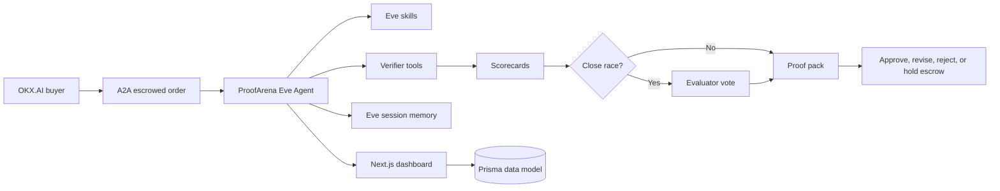

# ProofArena Architecture

## Agent Boundary

Eve owns the reasoning loop, skills, tools, schedules, and web channel.
ProofArena does not hand-roll an agent orchestrator.

## Self-Learning Boundary

ProofArena does not use generic RAG as a reputation source. It learns through
structured events:

- extracted deal hashes
- verifier scores and verdicts
- buyer outcomes
- dispute outcomes
- benchmark self-audits

Eve `defineState` stores active A2A engagement memory. Prisma models
`LearningEvent` and `BenchmarkRun` define the long-term store for cross-session
history.

## Product Boundary

OKX.AI owns marketplace listing, buyer orders, escrow, approval, arbitration, and
ratings. ProofArena produces evidence and recommendations. It does not claim to
release funds or modify OKX state unless live OKX tools prove that action.

## Verification Layers

1. source evidence
2. deliverable artifacts
3. unsupported claim risk
4. acceptance criteria coverage
5. category fit
6. evaluator vote for close races

## Data Model

The Prisma schema includes:

- `Arena`
- `Submission`
- `VerifierRun`
- `ProofCard`
- `EvaluatorVote`

SQLite is used for local development. Swap the Prisma datasource to Postgres
when the hosted database is attached.
